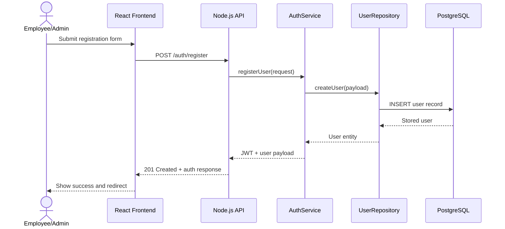
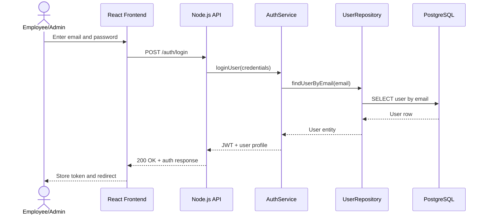
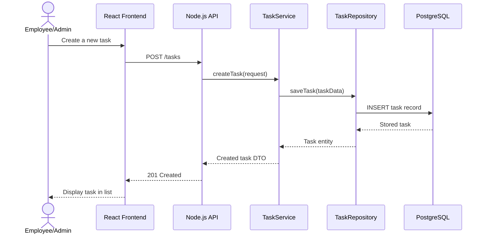
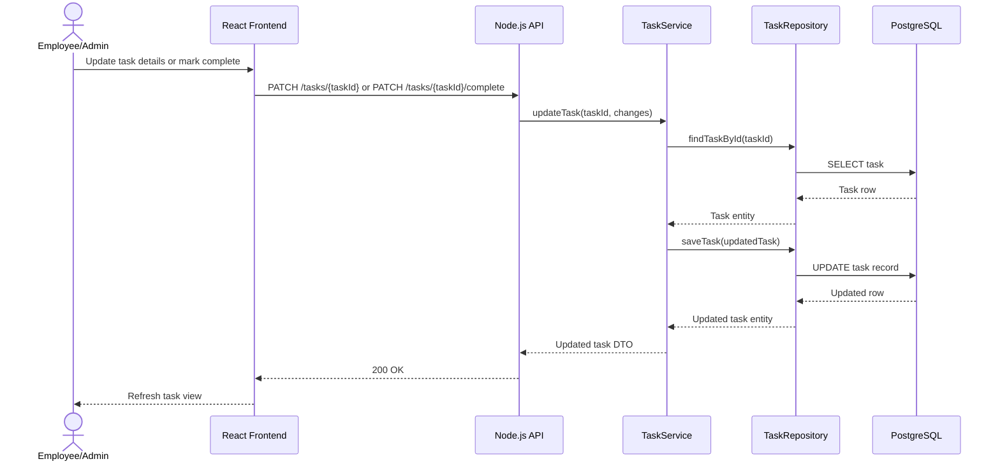
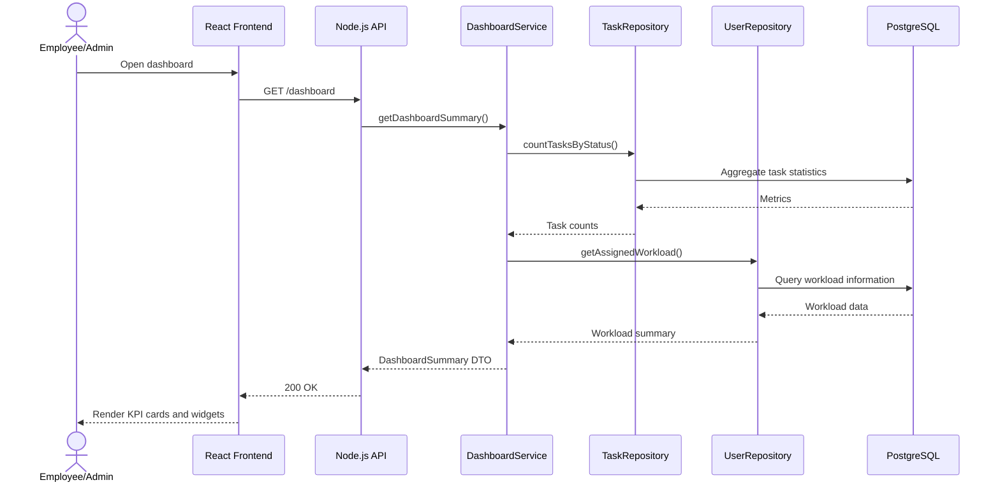
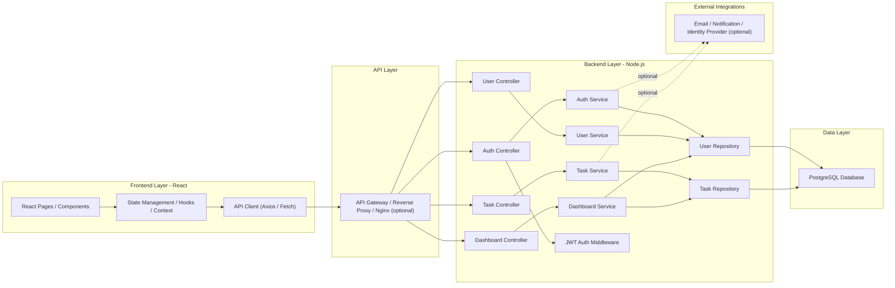

# Software Architecture for the Task Management Application

The diagrams below assume a typical full-stack implementation using React for the frontend, Node.js for the backend, Express/Fastify-style controllers, service-layer business logic, repository-layer persistence, and PostgreSQL as the primary database. The API contract in the OpenAPI spec is used as the basis for the design.

---

## 1. Sequence Diagrams

### 1.1 User Registration Flow

Explanation:
- The user starts from the React UI and submits a registration form.
- The API route is handled by an authentication controller, passed to the auth service, and persisted through the repository layer.
- The database stores the user, and a JWT is returned for future authenticated requests.

### 1.2 User Login Flow

Explanation:
- Authentication is verified by checking the user record in the database.
- A successful login returns a JWT that the frontend stores for later API calls.

### 1.3 Task Creation Flow

Explanation:
- Task creation follows the same layered pattern as user registration.
- The service layer handles validation and business rules, while the repository layer handles persistence.

### 1.4 Task Update and Completion Flow

Explanation:
- Updating a task and completing a task both go through the service and repository layers.
- Completion is modeled as a status transition from one task state to another.

### 1.5 Dashboard Summary Flow

Explanation:
- The dashboard aggregates task counts and workload insights from the persistence layer.
- This keeps the controller layer thin and pushes analytics logic into the service layer.

---

## 2. Class Diagrams

```mermaid
classDiagram
    class BaseEntity {
        +id: string
        +createdAt: Date
        +updatedAt: Date
    }

    class User extends BaseEntity {
        +firstName: string
        +lastName: string
        +email: string
        +passwordHash: string
        +role: UserRole
        +isActive: boolean
        +createUser()
        +updateUser()
        +deleteUser()
    }

    class Task extends BaseEntity {
        +title: string
        +description: string
        +priority: TaskPriority
        +dueDate: Date
        +status: TaskStatus
        +assigneeId: string?
        +createTask()
        +updateTask()
        +completeTask()
    }

    class DashboardSummary {
        +totalTasks: number
        +todoTasks: number
        +inProgressTasks: number
        +reviewTasks: number
        +doneTasks: number
        +overdueTasks: number
        +assignedTasks: number
    }

    class BaseDTO {
        +validate()*
    }

    class RegisterRequest extends BaseDTO {
        +firstName: string
        +lastName: string
        +email: string
        +password: string
        +role: UserRole
    }

    class LoginRequest extends BaseDTO {
        +email: string
        +password: string
    }

    class CreateUserRequest extends BaseDTO {
        +firstName: string
        +lastName: string
        +email: string
        +password: string
        +role: UserRole
    }

    class UpdateUserRequest extends BaseDTO {
        +firstName: string
        +lastName: string
        +role: UserRole
        +isActive: boolean
    }

    class CreateTaskRequest extends BaseDTO {
        +title: string
        +description: string
        +priority: TaskPriority
        +dueDate: Date
        +status: TaskStatus
        +assigneeId: string?
    }

    class UpdateTaskRequest extends BaseDTO {
        +title: string
        +description: string
        +priority: TaskPriority
        +dueDate: Date
        +status: TaskStatus
        +assigneeId: string?
    }

    class AuthResponse extends BaseDTO {
        +user: User
        +token: string
    }

    class UserListResponse extends BaseDTO {
        +items: User[]
        +pagination: Pagination
    }

    class TaskListResponse extends BaseDTO {
        +items: Task[]
        +pagination: Pagination
    }

    class Pagination {
        +page: number
        +pageSize: number
        +totalItems: number
        +totalPages: number
    }

    class BaseController {
        +handleError(error)
    }

    class AuthController extends BaseController {
        +register()
        +login()
        +logout()
    }

    class UserController extends BaseController {
        +listUsers()
        +createUser()
        +getUserById()
        +updateUser()
        +deleteUser()
    }

    class TaskController extends BaseController {
        +listTasks()
        +createTask()
        +getTaskById()
        +updateTask()
        +deleteTask()
        +completeTask()
    }

    class DashboardController extends BaseController {
        +getDashboardSummary()
    }

    class BaseService {
        +validateBusinessRules()*
    }

    class AuthService extends BaseService {
        +registerUser()
        +loginUser()
        +logoutUser()
    }

    class UserService extends BaseService {
        +listUsers()
        +createUser()
        +getUserById()
        +updateUser()
        +deleteUser()
    }

    class TaskService extends BaseService {
        +listTasks()
        +createTask()
        +getTaskById()
        +updateTask()
        +deleteTask()
        +completeTask()
    }

    class DashboardService extends BaseService {
        +getDashboardSummary()
    }

    class BaseRepository {
        +connect()
        +disconnect()
    }

    class UserRepository extends BaseRepository {
        +findByEmail()
        +findById()
        +save()
        +delete()
    }

    class TaskRepository extends BaseRepository {
        +findAll()
        +findById()
        +save()
        +delete()
        +countByStatus()
    }

    AuthController --> AuthService
    UserController --> UserService
    TaskController --> TaskService
    DashboardController --> DashboardService

    AuthService --> UserRepository
    UserService --> UserRepository
    TaskService --> TaskRepository
    DashboardService --> TaskRepository
    DashboardService --> UserRepository

    UserRepository ..> User
    TaskRepository ..> Task

    UserListResponse o-- "0..*" User : items
    TaskListResponse o-- "0..*" Task : items
    AuthResponse *-- User : user
    User "1" o-- "0..*" Task : assigned to
    Pagination o-- UserListResponse
    Pagination o-- TaskListResponse
```

Explanation:
- The domain model is centered on User and Task entities.
- Controllers expose HTTP endpoints, services enforce business rules, and repositories handle persistence.
- DTOs are used to structure request and response payloads.
- Composition is shown through response objects containing collections of domain entities, while inheritance is shown between base classes and concrete controllers, services, DTOs, and repositories.

---

## 3. Architecture Diagram

Explanation:
- The React frontend handles user interaction and calls the backend through an API client.
- The backend is organized into controllers, services, and repositories to keep responsibilities separated.
- The database is accessed only through repositories, which centralizes persistence logic.
- An optional API gateway or reverse proxy can sit in front of the Node.js backend for routing, TLS termination, and security.
- External integrations are shown as optional extensions for future enhancements such as notifications or identity services.

---

## Summary

This architecture supports the requirements defined by the OpenAPI specification by separating concerns across:
- UI layer for user interaction
- API layer for request handling
- Service layer for business logic
- Repository layer for persistence
- Database layer for data storage

This structure is scalable, easy to test, and suitable for implementing the authentication, user management, task management, and dashboard features described in the API.
